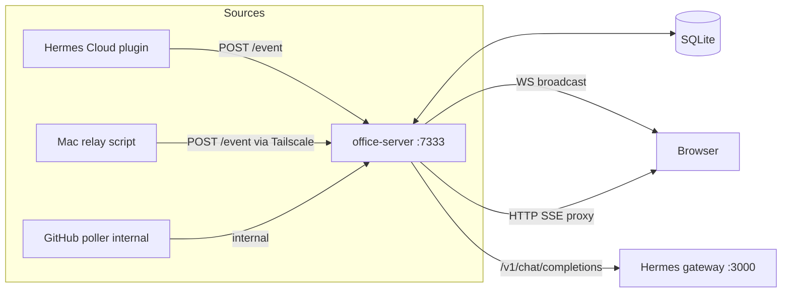

# Architecture — Hermes Office

> Pendamping PRD (`PRD.md`). Dokumen ini menjelaskan *bagaimana* sistem bekerja secara teknis.

## 1. System Context

Hermes Office adalah satu proses Node.js (`office-server`) yang berjalan di server LightVela, menggabungkan tiga peran:

1. **Event hub** — menerima event dari berbagai sumber, memvalidasi, membroadcast
2. **Static host** — menyajikan frontend build (dist/)
3. **Chat proxy** — meneruskan percakapan panel ke Hermes Cloud



## 2. Repository Layout

```
hermes-office/
├── README.md
├── docs/                    # PRD, arsitektur, deployment, dll.
├── server/                  # office-server (Node/Express/ws)
│   ├── index.js             # entry: HTTP + WS + static
│   ├── eventbus.js          # validasi + broadcast + ring buffer
│   ├── auth.js              # token per-source, guest token
│   ├── chat.js              # /chat/* routes → Hermes API proxy
│   ├── github.js            # poller Niumination (ETag caching)
│   ├── chat-db.js           # SQLite (port dari Claude-Office)
│   └── config.js            # env & config loader
├── bridges/
│   ├── hermes-cloud-plugin/ # plugin Hermes: hooks → POST /event
│   │   ├── HOOK.yaml
│   │   ├── handler.py
│   │   └── README.md
│   └── mac-relay/
│       ├── mac-relay.sh     # tail audit log → POST
│       ├── com.niumination.office-relay.plist
│       └── README.md
├── frontend/                # React + Vite (port Claude-Office src/)
│   ├── src/
│   │   ├── App.tsx
│   │   ├── components/      # Character, SpeechBubble, Panels
│   │   ├── events.ts        # WS client + event reducer
│   │   ├── rooms.ts         # peta kantor
│   │   └── niu/             # tema Niu-mode (sprites, palet)
│   ├── public/sprites/      # pixel art (dari Claude-Office, MIT + buatan sendiri)
│   └── vite.config.ts
├── scripts/
│   ├── deploy.sh            # build + restart systemd
│   ├── install-service.sh
│   └── dev.sh               # run semua lokal
├── tests/
│   ├── eventbus.test.js
│   ├── auth.test.js
│   └── contract/            # golden event payloads
├── .github/workflows/ci.yml
└── package.json
```

## 3. Data Flow — Event Lifecycle

### 3.1 Cloud path

```
Hermes Cloud turn selesai
  → plugin hook `post_tool_call` (dalam proses gateway)
  → handler.py serialize: {type, agent: "cloud", ...payload, ts}
  → HTTP POST http://127.0.0.1:7333/event (Bearer cloud-token)
  → eventbus.validate() → schema check, clamp strings, redact secrets
  → broadcast ke semua WS client + INSERT events (ring buffer)
```

**Penting:** plugin berjalan dalam proses gateway — POST harus **non-blocking** (fire-and-forget, timeout 2s, silent fail). Kegagalan office-server TIDAK BOLEH mempengaruhi gateway.

### 3.2 Mac path

```
launchd (KeepAlive) mac-relay.sh
  → tail -n 0 -F ~/.hermes/a2a_audit.jsonl
  → baris baru → python parse → map ke event contract
  → POST http://100.65.20.34:7333/event (Bearer mac-token) via Tailscale
  → retry eksponensial max 3x, lalu drop (jangan tumpuk antrean)
```

Saat Mac offline: tidak ada event — frontend menampilkan karakter Mac dalam `away` state (dipicu heartbeat timeout 90s di server).

### 3.3 GitHub path

```
setInterval 60s (dalam office-server)
  → GET /orgs/Niumination/repos?sort=pushed (ETag → 304 gratis)
  → untuk repo yang pushed_at berubah: GET /repos/.../commits?since=lastPoll
  → emit {type:"git_push", repo, author, commits:n, additions, privat}
  → privat=true hanya dikirim ke WS client owner (guest menerima versi [private])
```

## 4. Frontend Rendering

Port dari Claude-Office dengan perubahan:

| Aspek | Claude-Office | Hermes Office |
|---|---|---|
| Sumber karakter | Agent Claude Code spawn | Roster tetap: cloud, mac, boss + karakter event dinamis |
| Posisi meja | Dinamis per agent id | Meja tetap (karakter pindah meja saat bertugas) |
| Sumber chat AI | `claude -p` subprocess | HTTP ke office-server → Hermes API |
| Sprite | Pixel art Claude | Reuse + tambahan sprite Hermes/Niu |
| State storage | localStorage | localStorage (pref) + server (chat/events) |

Rendering isometrik: tile grid + CSS transform, karakter = sprite sheet frame. Semua logika animasi (walk, typing bubble, coffee break) diwarisi tanpa perubahan — hanya *pemicu* event yang diganti.

## 5. Chat Bridge Detail

```
Browser ──POST /chat {text}──► office-server
   office-server ──POST /v1/chat/completions (stream:true)──► Hermes gateway
   ◄── SSE chunks ──
   ◄── WS frame {type:"chat_delta"} ──► Browser (render streaming)
   selesai → simpan ke SQLite → WS frame {type:"chat_done"}
```

Routing `@mac`:
```
text mengandung "@mac"
  → office-server POST A2A SendMessage ke 100.120.57.37:9900 (token peer)
  → balasan satu-turn dikirim sebagai chat agent "mac"
  → TIDAK ada auto-continuation; anti-loop cap 1 turn (konfigurabel max 3)
```

## 6. Keamanan (ringkas — detail di SECURITY.md)

| Layer | Mekanisme |
|---|---|
| Transport | HTTPS (proxy platform) + WSS |
| Auth | Bearer token per source (cloud, mac) + owner token + guest token |
| Input | Schema validasi + string clamp (warisan Claude-Office) |
| Output | Secret redaction (regex key/JWT) sebelum broadcast & persist |
| Guest | Filter event: repo privat, chat content, URL internal tidak dikirim |
| Rate limit | 60/min per token; 1000/min guest aggregate |

## 7. Deployment Topology

```
Internet ──► lightvela.ai platform proxy (443)
                │  (route: office.lightvela.ai ATAU /office/)
                ▼
        office-server 127.0.0.1:7333
                │
        systemd user unit hermes-office.service
        (Restart=always, After=network.target)
```

Fallback tanpa subdomain: **Tailscale-only** — akses via `http://100.65.20.34:7333` dari device dalam tailnet (tetap real-time, tidak publik).

## 8. Observability

- `/health` — uptime, ws clients, events/min, chat queue
- Log terstruktur JSON ke journald (unit systemd), level via `LOG_LEVEL`
- Event ring buffer bisa diintip: `GET /debug/events?limit=50` (owner only)

## 9. Testing Strategy

| Level | Cakupan |
|---|---|
| Unit | eventbus validasi, auth, redaction, github diffing |
| Contract | golden payload per event type (bridge ↔ server kompatibilitas) |
| Integration | docker-compose: server + mock hermes + mock github; mainkan skenario |
| E2E manual | checklist: task Telegram → animasi; chat; guest; Niu-mode |

## 10. Konfigurasi (env)

| Var | Default | Fungsi |
|---|---|---|
| OFFICE_PORT | 7333 | Port internal |
| OFFICE_CLOUD_TOKEN | (wajib) | Token bridge cloud |
| OFFICE_MAC_TOKEN | (wajib) | Token bridge mac |
| OFFICE_OWNER_TOKEN | (wajib) | Token owner |
| OFFICE_GUEST_TOKEN | (opsional) | Token guest read-only |
| HERMES_API | http://127.0.0.1:3000 | Hermes API server |
| HERMES_A2A_MAC_URL | http://100.120.57.37:9900 | Mac A2A endpoint |
| GITHUB_TOKEN | (dari .env) | Poller |
| GITHUB_ORG | Niumination | Org target |
| ALLOWED_ORIGINS | https://office.lightvela.ai | WS origin check |
